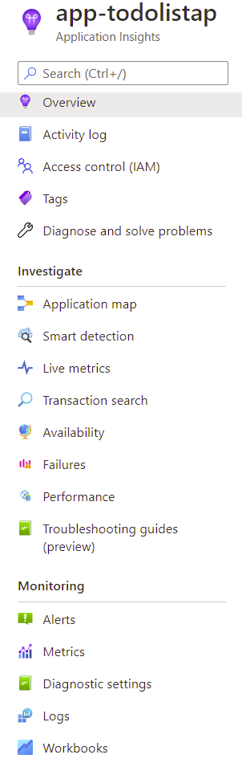
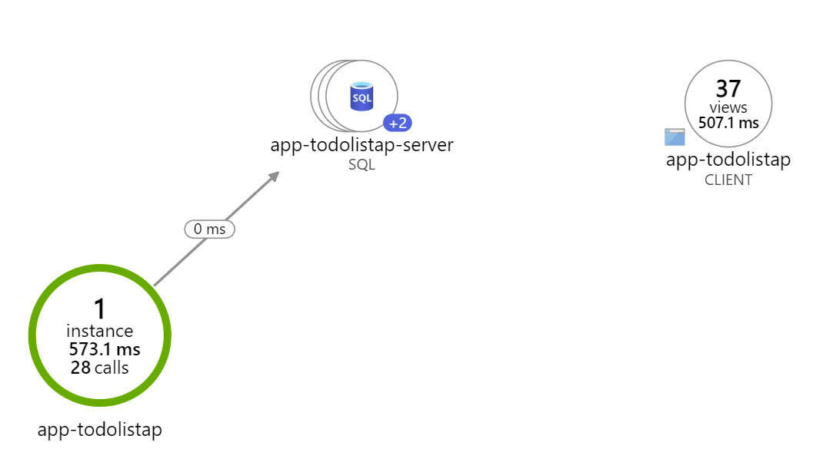
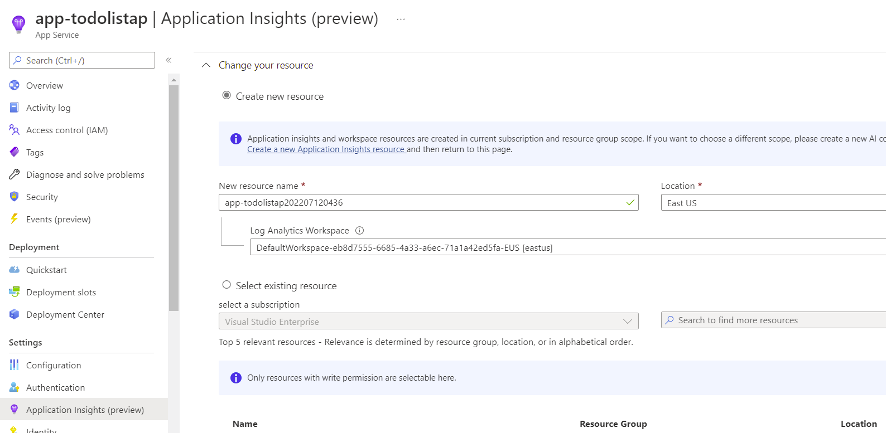
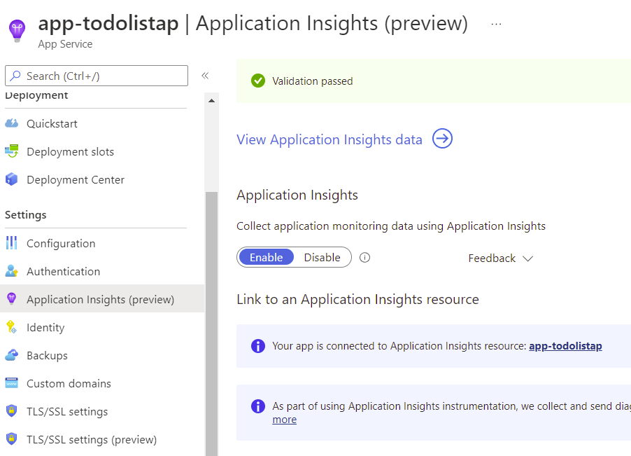

# Explore App Insights

--------------------------------------

Once you are looking at your application insights, you can explore the different services available.  Select application map from the menu on the left.

## Explore application map
[Application Maps](https://docs.microsoft.com/en-us/azure/azure-monitor/app/app-map?tabs=net)
Application Map helps you spot performance bottlenecks or failure hotspots across all components of your distributed application. Each node on the map represents an application component or its dependencies; and has health KPI and alerts status. You can select any component to get more detailed diagnostics, such as Application Insights events. If your app uses Azure services, you can also select Azure diagnostics, such as SQL Database Advisor recommendations.

- Choose to create a new resource, or select an existing Application Insights resource for this application
>When you click OK to create the new resource you will be prompted to Apply monitoring settings. Selecting Continue will link your new Application Insights resource to your app service, **doing so will also trigger a restart of your app service**.

- 

- After app insights is configured, you should get a link to it.  Follow it to exlpore your new App Insights.
- 

# Next Steps
[Exploring Application Insights](Explore.md)

## This guide references and uses examples from each of the following:
https://docs.microsoft.com/en-us/azure/azure-monitor/app/azure-web-apps-net-core?tabs=Windows%2Cwindows
