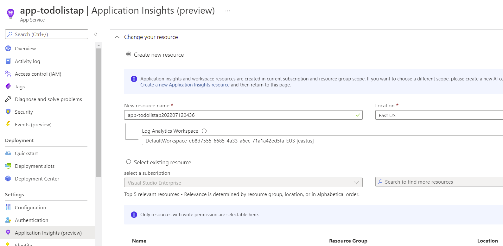

# Setup App Insights

--------------------------------------

Follow these steps to setup your environment to run the Azure App Insights Demo.  

> This demo requires an active azure app service.  If you don't have a current web app to test, please follow [this guide](https://docs.microsoft.com/en-us/azure/app-service/tutorial-dotnetcore-sqldb-app?pivots=platform-linux&tabs=azure-portal%2Cvisualstudio-deploy%2Cdeploy-instructions-azure-portal%2Cazure-portal-logs%2Cazure-portal-resources#1---set-up-the-sample-application) to create a new web app with dependancies to monitor. This demo will also use this source code as the example for the demo.

# Turn on Azure App Insights
This demo provides the quickest way to configure Application insights for a running app service.
In your Azure portal navigate to your app service to configure App Insights for.

- Choose to create a new resource, or select an existing Application Insights resource for this application
>When you click OK to create the new resource you will be prompted to Apply monitoring settings. Selecting Continue will link your new Application Insights resource to your app service, **doing so will also trigger a restart of your app service**.

- 

- After app insights is configured, you should get a link to it.  Follow it to exlpore your new App Insights.
- 

# Next Steps
[Exploring Application Insights](Explore.md)

## This guide references and uses examples from each of the following:
https://docs.microsoft.com/en-us/azure/azure-monitor/app/azure-web-apps-net-core?tabs=Windows%2Cwindows
